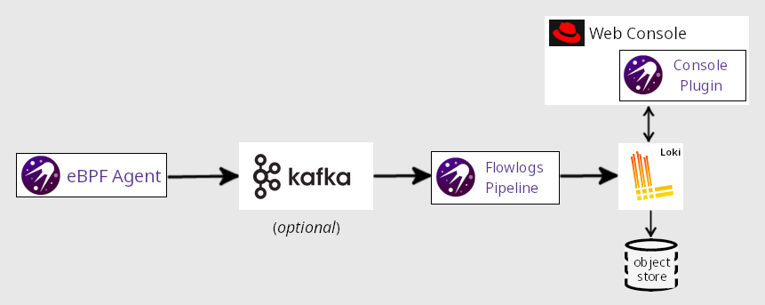
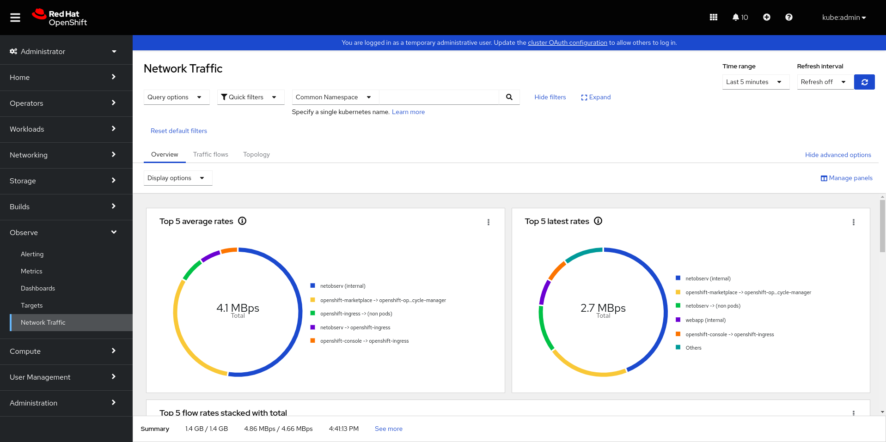
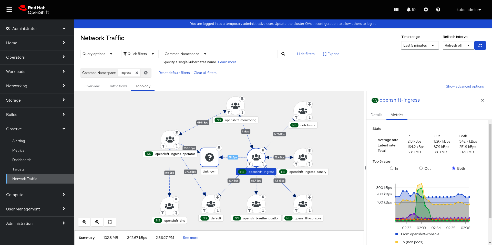
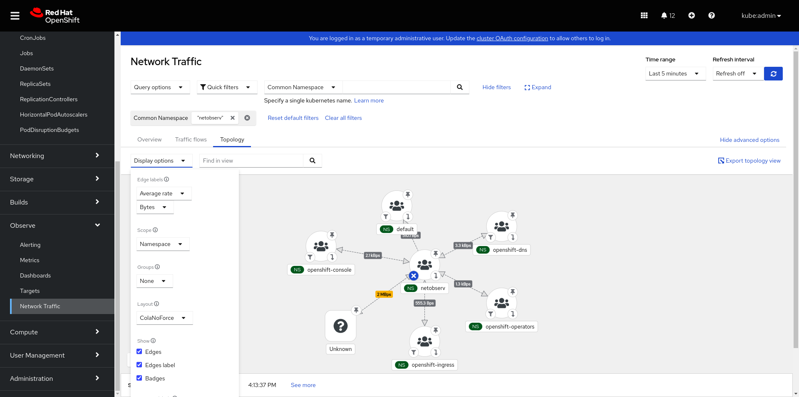
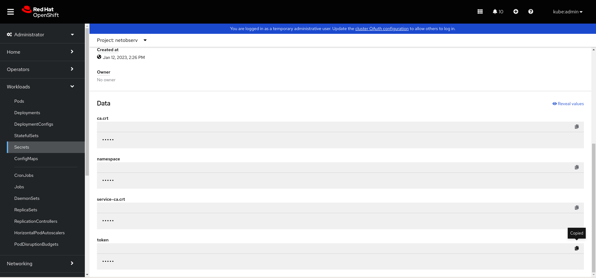
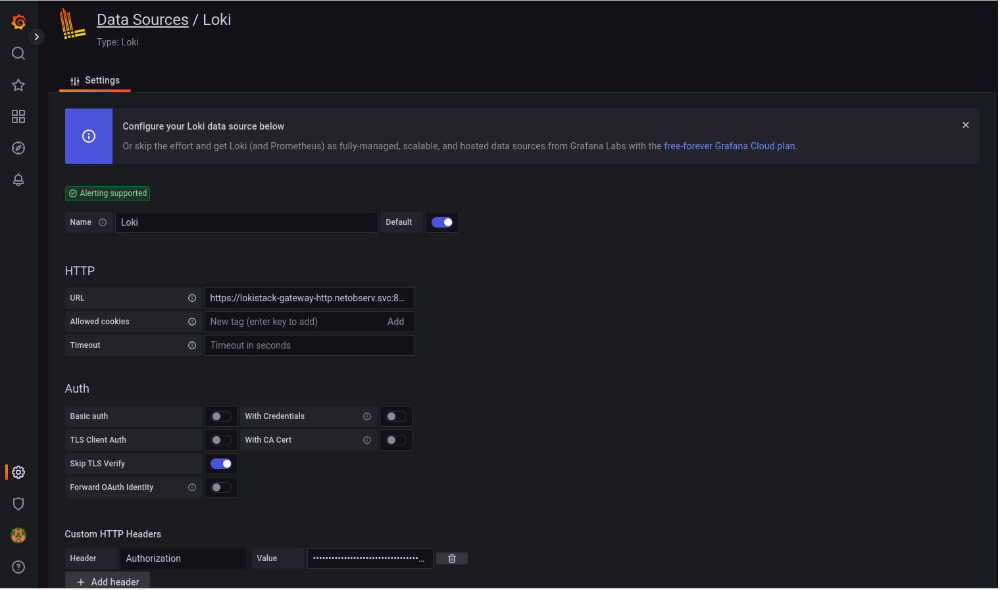
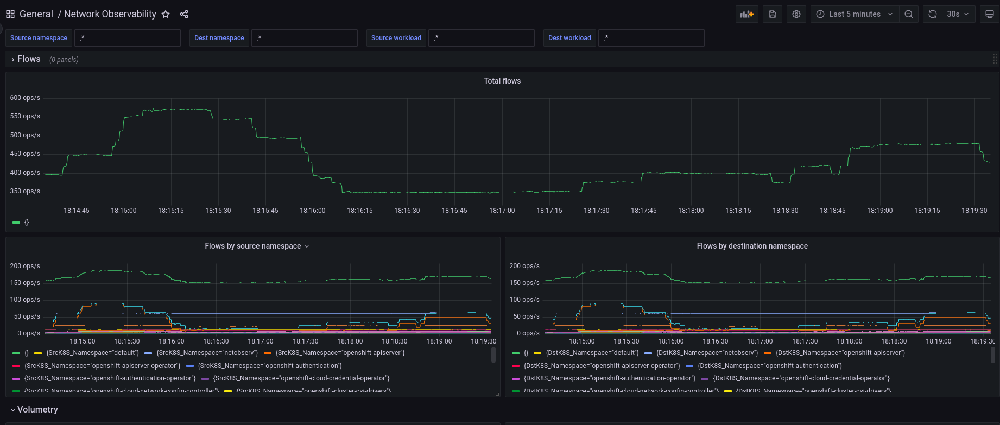
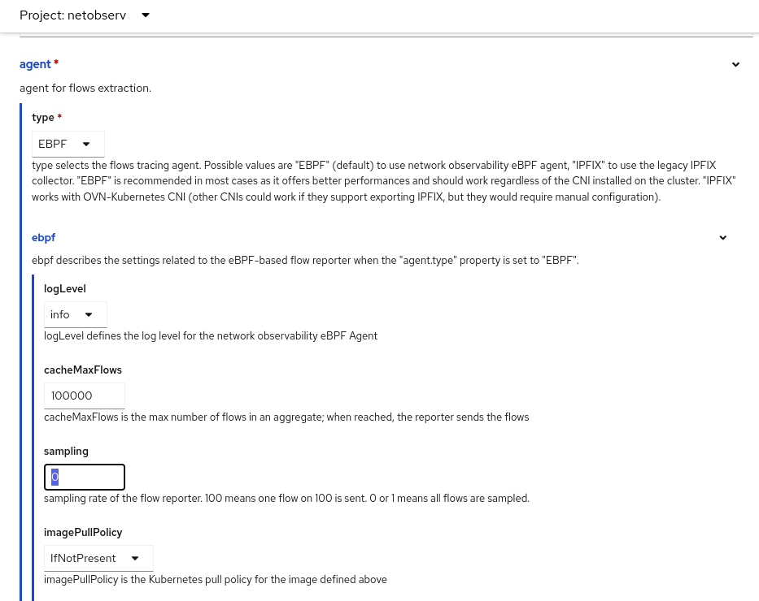
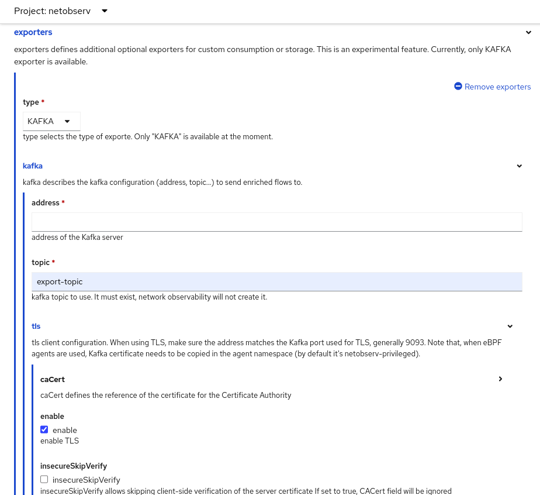

# Announcing Network Observability

If you are on an airplane and look down on a metropolis on a busy day, you will
see thousands of cars, trucks, and motorcycles driving from every which way at
various speeds. There will be traffic jams in some places, cars racing across
the highways, other cars completely stopped at intersections, and vehicles
parked at various locations. If you focus on a single vehicle, you can even
track its starting point and its final destination.

With the release of OpenShift 4.12, Red Hat is introducing a new feature called
Network Observability. Like this airplane view, you will be able to visualize
the moving traffic. Instead of vehicles, it is the data that's moving in your
Kubernetes cluster. Prior to 4.12, you could only see snapshots of this
traffic. It is the difference between taking a picture versus filming a video.

Why is this important? Because with a video, you now have a record of
everything that happened. It generates a timeline of events for every movement
that's made so all of this is captured and stored. By organizing this data,
you can replay the entire stories that happen concurrently. For example, when
there is a problem such as a traffic jam (latency), you will know what
happened, who was involved, when it occurred and for how long, where it
happened, and with analysis, you might be able to figure out why it happened
and how to prevent it from happening again in the future. Perhaps to avoid
this latency that tends to occur at a certain time of the day, you could
increase the amount of bandwidth only for this period of time to improve
utilization and do better cost analysis and planning.

## Network Observability Architecture

The core of Network Observability is to collect network flows or more
specifically IPFIX data and then present this using powerful visualizations.
NetFlows, as they were originally called, existed back in the 1990s as a way to
capture that network insight at layer 3 and 4 of the OSI model.

What is unique about this solution thirty years later is that instead of having
a typical router or switch export IPFIX data, an eBPF Agent was developed to
hook into the network events so it can capture and export data coming in and
out of the interfaces at the kernel level. eBPF is a relatively new technology
that allows a program to run in a sandboxed environment, thus extending the
kernel in a safe and secure manner. Yet, it is not that new as the eBPF Agent
will work as far back as Linux kernel 4.18 which was released in 2018. The
immediate benefit of the eBPF approach is that it is more performant than the
router/switch solution. In addition, it is not dependent on a particular CNI
(Container Network Interface) such as OpenShift SDN or OVN-Kubernetes.

On the receiving end of this exported data is a flow collector called the
Flowlogs Pipeline (FLP) that processes this data, enriches it to be
Kubernetes-aware, and deduplicates redundant and less relevant data. If you
have bursty or high amounts of traffic, you will want to consider installing
Apache Kafka to be the middleman in between the eBPF Agent and FLP to help with
buffering and improve streaming.

Network Observability also includes a Console Plugin that extends the
browser-based Web Console. FLP sends the data to Loki to write out to storage.
Loki provides an API for the Console Plugin to query for information to be
displayed. A high level architectural diagram looks like this:

_
Figure 1: Architectural Diagram
_

## Installing Network Observability

If you create an OpenShift 4.12 cluster, you will not find Network
Observability because it is an optional operator that needs to be installed
separately. However, it is included with the self-managed
[Red Hat OpenShift Container Platform](https://www.redhat.com/en/technologies/cloud-computing/openshift/container-platform)
offering at no extra cost. The good news is that since it is separate from the
core platform, it is supported retroactively back to OpenShift 4.10!

The [Network Observability docs](https://docs.openshift.com/container-platform/4.12/networking/network_observability/network-observability-overview.html)
provide a great step-by-step guide on installing Network Observability. Now
that you've seen the architectural diagram, you know all of the major
components that are involved. The Network Observability Operator only manages
eBPF Agent, Flowlogs Pipeline, and Console Plugin. The main items to consider
for installation are:

1. Provide an object store 
See the [list of supported object stores](https://grafana.com/docs/loki/latest/operations/storage/).
You will need to create a secrets file to access the object store.

2. Install Loki 
The recommendation is to install Loki Operator 5.6, which simplifies the
deployment of Loki in microservices mode that is necessary for scalability. In
Web Console, you can do this from OperatorHub. Note that if you already have
Loki installed for another purpose, it cannot be shared. You must still
install a separate Loki for Network Observability.

3. Decide if you need Kafka 
For clusters with ten nodes or less, you can try without Kafka. If you have
25+ nodes, then most likely, you will need it. Anything in between depends on
the volume of network traffic. If you install Kafka and accept all or most of
the default values, it will handle about 5K flows per second (fps) and take
less than 5% of your current CPU and memory resources. Kafka can be installed
using the Red Hat AMQ Streams operator in OperatorHub.

4. Decide on sampling rate 
The fps is affected by the sampling rate. Sampling refers to the ratio of
packets that are evaluated. It defaults to 50, meaning one out of 50 packets
are considered and the rest are ignored. A value of 0 or 1 means no sampling
and all packets are considered. When you create a Flow Collector resource from
Network Observability Operator, the sampling field is in the eBPF section.

5. Consider scalability 
If you have high network traffic volume, check the documentation on the list of
parameters to change to better support scalability. We've tested up to 120
nodes with 100 pods each, no sampling, and traffic continuously running on 10%
of the pods. This consumed between 8-12% additional CPU and 4-8% additional
memory.

## Using Network Observability

Network Observability is only available to users with the cluster-admin role,
such as kubeadmin, since this user can see all the traffic in the cluster, both
infrastructure-related and all applications. It handles one cluster so any
traffic that goes out or comes into this cluster is considered external traffic
even if the traffic is from another cluster that you manage.

Once you have Network Observability installed and have created a FlowCollector
resource, behind the scenes, the network flow data will be created, collected,
enriched with Kubernetes-related information such as the namespaces and pod
names, and then saved to object store. The Web Console will pop up a dialog
asking you to refresh the web page. After that, a new menu item under
**Observe** called **Network Traffic** appears.

_
Figure 2: Overview
_

Above the charts in Figure 2, there are common settings that apply to the three
tabs near the top called Overview, Traffic flows, and Topology. The first
dropdown is Query options. In it, you can decide what flows are shown. By
default, it is **Destination** which means it is the ingress traffic to the
node as opposed to **Source** which is the egress traffic. You typically don't
want **Both** since it will end up reporting the same flow twice, but that may
be necessary if you need to know exactly where the traffic flowed into and out
of the interfaces. There is also a choice for how you want to match filters
(more on that later) and the maximum number of flows to retrieve.

Next is Quick filters. The default excludes infrastructure traffic so if
you have a new cluster with no applications running, there will be no data.
The next field provides a powerful filtering capability. Select a choice
such as Common Namespace and enter a value to build your filter. If you add
multiple values for the same field, it will assume this is an OR operation.
Between two different fields, it is an AND operation. This is where the Query
options can change this also to an OR operation. In the dropdown, the word "Common" indicates that the field value can be on the source or destination side.

There are links like **Expand** that maximizes the space for this panel. In the
upper right corner, you can set the time range for the data and have the
panel refresh automatically at various intervals if desired.

The three tabs present different visualizations for the traffic flows. In the
Overview tab (Figure 2), there are a number of different chart types that gives
you a summary of the bandwidth usage. The Traffic flows tab (Figure 3)
presents a detailed table of each flow enriched with Kubernetes metadata and
the ability to choose what columns to display.

_
Figure 3: Traffic flow table
_

 
Finally, the Topology tab (Figure 4) raises the bar on the user interface by
providing a graphical representation of traffic flows.

_
Figure 4: Topology view
_

## Use Cases

Now that you have a general overview of Network Observability, let's look at
some concrete things you can do with it. I will go over two basic use
cases, and encourage you to try these out or come up with your own scenarios.

### Use case #1: As a cluster-admin, I want to see what traffic is running on my network.

With Network Observability, you can see all the network traffic if you clear
the default filter so that traffic generated by Kubernetes is also captured.
In the Overview tab, it shows the top namespaces using the most bandwidth.
Going forward, more charts will be added for protocol, ports, ingress/egress
traffic and more.

If I want to narrow down to something more specific, I can easily do this.
Let's observe **Network Observability** and see what traffic it's generating!
Network Observability uses two namespaces, *netobserv* and
*netobserv-privileged*. The *netobserv-privileged* namespace is where the eBPF
Agent runs because it requires special Linux capabilities. The traffic appears
in *netobserv* so just filter on this namespace. You can view the data from any
of the three tabs, but the best one is Topology as shown in Figure 5.

_
Figure 5: Topology - netobserv
_

Here, you can see *netobserv* interacting with *openshift-console*,
*openshift-ingress*, *openshift-dns*, and others. I clicked the "Show advanced
options" so on the left side, you can tweak various settings in the graph. On
the right side, there is also a link called "Export topology view" to export
the graph as a PNG file.

The Overview tab only has a few graphs so if you want something more specific,
you can install Grafana and create your own dashboards and queries by following
these steps in Web Console.

#### Install Grafana
1. If in Administrator view, click **Administrator** and then select
**Developer** to switch to Developer view.
2. Click the **Project** drop-down menu and choose **netobserv**.
3. Click **+Add** and then click the **Container images** section.
4. Enter `grafana/grafana` for the image name. Optionally for Application,
you can select "No application group".
5. Click **Create**.

#### Log into Grafana
6. In the **Topology** panel, click the arrow badge on the **grafana** icon
to launch the web page for Grafana. You may have to wait a few seconds for
the pod to come up. The page indicates that it’s not secure, but go ahead
and continue.
7. Log in and enter `admin` for the user and `admin` for the password.
8. Click **Skip** to skip changing passwords.

#### Create data source to get data from Loki
9. On the left menu, click the gear icon near the bottom and select **Data sources**.
10. Click **Add data source** and select **Loki**.
11. For the **URL**, enter the same value you use for the Loki **url** in FlowCollector (e.g. https://lokistack-gateway-http.netobserv.svc:8080/api/logs/v1/network).
12. Turn on **Skip TLS Verify** or provide a CA certificate.
13. Click **Add header**. For **Header**, enter `Authorization`. An OAuth
token is needed for **Value**. This token will be copied from the service
account *netobserv-plugin*.

    a) In Web Console, go to **Workloads > Secrets**. 
    b) Look for **netobserv-plugin-token-\*** and select this entry. If you do not see this entry, you most likely are not using Loki Operator 5.6 or you did not configure this properly. 
    c) Scroll down to the **token** section. Click the copy icon to copy the token. See Figure 6.

_
Figure 6: Secret - Token data
_

14. Now go back to Grafana and in the **Value** field, carefully enter `Bearer`
followed by a space, and then paste in the token value. You won't be able to
see what you are typing so make sure you do this correctly.

_
Figure 7: Loki data source
_

15. Click **Save & test** button at the bottom. If everything went well,
you will get a green checkmark and no red notices.

#### Create dashboards

16. Now you can create your own dashboards. If you want to try an example,
download the dashboard JSON file [here](https://raw.githubusercontent.com/netobserv/network-observability-operator/0.1.2/config/samples/dashboards/Network%20Observability.json).
On the left menu, click the **+** icon and select **Import**. Click the
**Upload JSON file** button, and select the file you just downloaded. You
should see the graphs now as shown in Figure 8.

_
Figure 8: Grafana dashboard
_

### Use case #2: As a network analyst, I want to perform a network audit.

Network Observability will perform the first step in your auditing process by
collecting the network flow data. Be sure you are capturing all traffic in
your network by turning off sampling. The sampling rate is configured when you
create a FlowCollector resource. This is the **sampling** field in the
**ebpf** section. Set this to 0 for no sampling.

_
Figure 9: FlowCollector - sampling
_

You can also edit the YAML resource and change the sampling rate for an
existing FlowCollector. This will restart the Network Observability pods and
cause a small interruption in collecting data, but your data will otherwise be
preserved.

You will need your own tools to do the analysis and audit report. Network
Observability provides a way to export the flow data via Kafka so you can use
any software that can accept a Kafka stream. Please note that in OpenShift
4.12, export Kafka data is a Technical Preview feature.

To set this up, make sure you have Kafka installed for Network Observability.
In Kafka, create a specific Kafka topic for exporting, separate from the one
that is used by eBPF Agent. If you installed with Red Hat AMQ Streams, there
is an API for Kafka Topic. The next steps are to configure FlowCollector.

1. In **deploymentModel**, select KAFKA.
2. In the **exporters** section, for the **type**, select KAFKA.
3. In the **kafka** section, provide the **address** of the Kafka server
that you have installed.
4. For **topic**, enter the Kafka topic that you created earlier.
5. For **tls**, provide the CA certificate information to communicate with
the Kafka server.

_
Figure 10: FlowCollector - exporters
_

Finally, configure your software to be a Kafka consumer to receive this data.
Make sure you are using the same port on both sides. The format will be in
JSON and looks like the raw JSON that you see when you select a row in the flow
table and select the **Raw** tab.

## Wrap Up

I hope this shows you the exciting possibilities that Network Observability is
capable of. Getting snapshots of your network with metrics and logs like a
photo from a camera is decent. Augmenting it by tracking movements like a full
motion video camera raises it to another level. The Network Observability
feature is also setting the direction in two other areas.

1. This is OpenShift's first major foray into eBPF technology. Expect more to come in its use in other areas.
2. The topology visualization raises the bar on what can be done in Web Console. Look for even more tantalizing visualizations in the future.

One final note is that Network Observability is an [upstream open source
project](https://github.com/netobserv). This means it will work outside of
OpenShift. It also means if you are as excited as we are about observability,
you can contribute to this legacy. :smiley: I expect there to be many
questions and feature requests so let the data flow!

